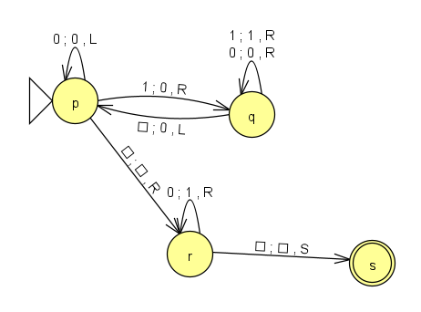

## Actividad 2

### Máquina de Turing que duplica unos

### JFLAP



### Definición formal
```
MT  = < Γ = {0,1,▯},
        Σ = {1},
        b = {▯},
        Q = {p,q,r,s},
        q0 = p,
        F = {s},
        δ = { δ(p,1)=(q,0,R),
              δ(p,0)=(p,0,L),
              δ(p,▯)=(r,▯,R),
              δ(q,1)=(q,1,R),
              δ(q,0)=(q,0,R),
              δ(q,▯)=(p,0,L),
              δ(r,0)=(r,1,R),
              δ(r,▯)=(s,▯,S),
            }
      >
```
### Matriz de transiciones

| δ  | 1   | 0   | ▯   |
|:--:|:---:|:---:|:---:|
| >p | q0R | p0L | r▯R |
| q  | q1R | q0R | p0L |
| r  | -   | r1R | s▯S |
| *s | -   | -   | -   |

<br>

Haz clic aquí para [Descargar el archivo JFLAP](./archivos/MTduplicaUnos.jff)

<br>

### Turing machine simulator

🔗 (http://turingmachinesimulator.com/shared/pqxohhxrtg)

```
//-------CONFIGURATION
name: Duplica unos
init: p
accept: s

//-------DELTA FUNCTION:
p,0
p,0,<

p,1
q,0,>

q,_
p,0,<

q,0
q,0,>

q,1
q,1,>

p,_
r,_,>

r,0
r,1,>

r,_
s,_,-
```


