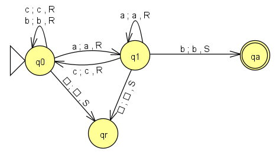
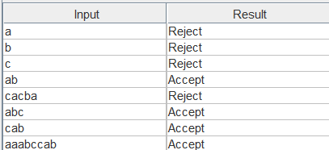
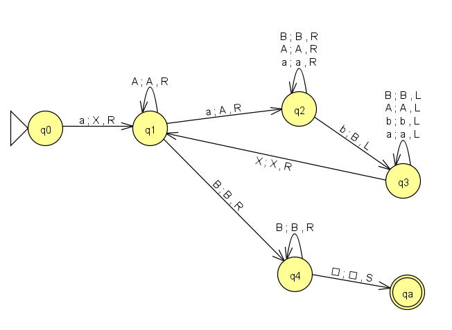
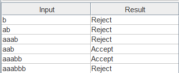

## Actividad 3

## MT para un lenguaje regular (LR)

L = { w1**ab**w2 / w1, w2 ∈ {a,b,c}*}>
<p>Todas las palabras sobre el alfabeto {a,b,c} que contengan la subcadena "ab"</p>

### JFLAP



### Definición formal
```
MT  = < Γ = {a,b,c,▯},
        Σ = {a,b,c},
        b = {▯},
        Q = {q0,q1,qa,qr},
        q0 = q0,
        F = {qa},
        δ = { δ(q0,a)=(q1,a,R),
              δ(q0,b)=(q0,b,R),
              δ(q0,c)=(q0,c,R),
              δ(q0,▯)=(qr,▯,S),
              δ(q1,a)=(q1,a,R),
              δ(q1,b)=(qa,b,S),
              δ(q1,c)=(q0,c,R),
              δ(q1,▯)=(qr,▯,S),
            }
      >
```
### Matriz de transiciones

| δ  | a   | b   | c   | ▯   |
|:--:|:---:|:---:|:---:|:---:|
| >q0 | q1aR | q0bR | q0cR |qr▯S |
| q1 | q1aR | qabS | q0cR |qr▯S |
| qr  | -   | -   | -   | -   |
| *qa | -   | -   | -   | -   |

### Prueba de pertenencia al lenguaje


<br>

Haz clic aquí para [Descargar el archivo JFLAP](./archivos/MTaceptawconab.jff)

<br>

## MT para un lenguaje independiente del contexto (LIC)

L = { a<sup>m+1</sup>b<sup>m</sup> | m ≥ 1 }

### Producciones

S -> aSb<br>
S -> aab

### JFLAP



### Definición formal
```
MT  = < Γ = {a,b,X,A,B,▯},
        Σ = {a,b},
        b = {▯},
        Q = {q0,q1,q2,q3,q4,qa},
        q0 = q0,
        F = {qa},
        δ = { δ(q0,a)=(q1,X,R),
              δ(q1,a)=(q2,A,R),
              δ(q1,A)=(q1,A,R),
              δ(q1,B)=(q4,B,R),
              δ(q2,a)=(q2,a,R),
              δ(q2,b)=(q3,B,L),
              δ(q2,A)=(q2,A,R),
              δ(q2,B)=(q2,B,R),
              δ(q3,a)=(q3,a,L),
              δ(q3,b)=(q3,b,L),
              δ(q3,X)=(q1,X,R),
              δ(q3,A)=(q3,A,L),
              δ(q3,B)=(q3,B,L),
              δ(q4,B)=(q4,B,R),
              δ(q4,▯)=(qa,▯,S)
            }
      >
```
### Matriz de transiciones

| δ  | a   | b   | X   | A   | B   |▯   |
|:--:|:---:|:---:|:---:|:---:|:---:|:---:|
| >q0|q1XR | -   | -   | -   | -   | -   |
| q1 |q2AR | -   | -   |q1AR |q4BR | -   |
| q2 |q2aR | q3BL| -   |q2AR |q2BR | -   |
| q3 |q3aL | q3bL|q1XR |q3AL |q3BL | -   |
| q4 |-    | -   | -   | -   |q4BR |qa▯S|
|*qa |-    | -   | -   | -   | -   | -   |

### Prueba de pertenencia al lenguaje


<br>

Haz clic aquí para [Descargar el archivo JFLAP](./archivos/MTLIC.jff)

<br>

<hr>

## Diferencia entre MTAccept y MTCalc

| Característica | MTAccept | MTCalc |
|---|---|---|
| **Objetivo** | Reconocer/aceptar un lenguaje | Calcular una función |
| **Entrada** | Una palabra o cadena w | Una palabra o cadena w que representa un dato |
| **Qué hace** | Determina si w pertenece o no al lenguaje | Transforma la entrada para obtener un resultado |
| **Resultado** | Acepta o rechaza la entrada | Devuelve el valor de la función calculada |
| **Contenido final de la cinta** | No representa el resultado. El resultado está dado por la aceptación o rechazo | Representa el resultado del cálculo |
| **Ejemplo** | Determinar si una palabra comienza y termina con el mismo símbolo | Duplicar unos |
