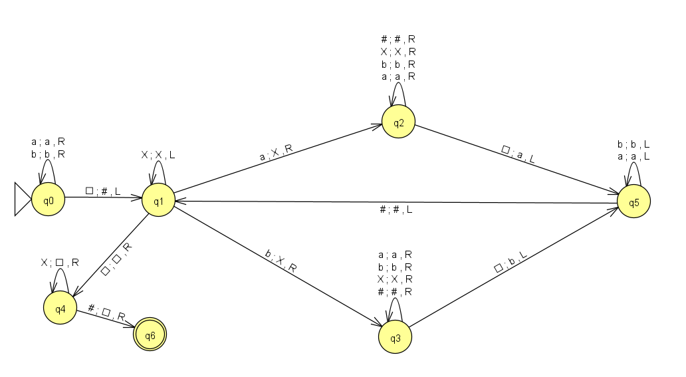
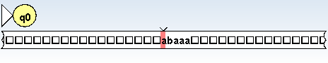
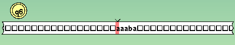
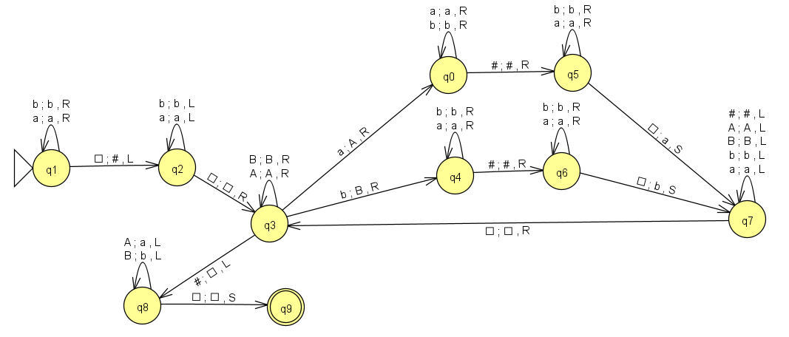

## Actividad 4

## TP Máquina de Turing Calculable

1 - Calcular la imagen especular de una cadena definida sobre {a,b}, es decir f(w)=reverso(w). Ejemplos: f(aabb)=bbaa y f(aba)=aba *

 

<b>*Ejemplo*</b>

Contenido inicial de la cinta

 

Contenido final de la cinta

 

Haz clic aquí para [Descargar el archivo JFLAP](./archivos/MTC1.jff)
  

2 - Duplicar una cadena de aes y bes en la cinta. Ejemplo: si la MT comienza con abbaa□ en su cinta, luego de procesar su programa debe terminar con abbaa□abbaa

 
 

Haz clic aquí para [Descargar el archivo JFLAP](./archivos/MTC2.jff)

 

3 - Se dispone de una cinta en la que hay un número m de 1s seguido de un número n ≥ m de Aes. Se desea definir una MT que cambie las primeras m Aes por Bes. Se supone que la cabeza de la cinta inicialmente está en el 1 más a la izquierda 

4 - Comprobar si dos palabras formadas con símbolos de Σ = {0, 1, 2} son iguales. Las dos palabras están separadas por el símbolo #

5 - Sumatoria de (n + i) , con 1 ≤ i ≤ n, con n codificado en unario

6 - [(x*y) / 2], para x, y > 0 codificados en unario

7 - x mod y, para x, y > 0, codificados en unario

8 - La parte entera superior del promedio de n números mayores que cero codificados en unario. Usar como separador de números unarios en la cinta de entrada al símbolo 0. Ejemplo: * Cinta de entrada: 111110111010 (números 5, 3 y 1) * Cinta resultado: 111 (cálculo [(5 + 3 + 1) / 3] = 3)

9 - Calcular a^nba^m -> a^(n+m)b

10 - Decidir si m < n, a^nb^m / n, m > 0, escribiendo en la cinta T (true) o F (false)

11 - Que recibe un número binario (cadena no vacía de 0’s y 1’s) y devuelve el siguiente número binario (es decir, le suma 1)

12 - Para eliminar el blanco que separa los dos argumentos x e y, moviendo los símbolos de y un lugar hacia la izquierda. Σ = {a, b}

13 - MT de 3 cintas que reste el número binario de la segunda cinta del número binario de la primera y deje el resultado en la tercer cinta. Hacer otra, suponiendo que la MT es de 2 cintas y que el resultado se deja sobre la segunda. Hacerlo también para que el resultado quede en la primera

14 - MT de 3 cintas que determine si el número binario que está en la primera cinta es menor que el de la segunda. Si es menor, escribir el símbolo S sobre la tercer cinta y si no lo es, escribir los símbolos GE sobre la tercer cinta

15 - Una cinta contiene dos cadenas binarias X e Y separadas por el símbolo * tales que la longitud de cada cadena es la mínima necesaria para representar el número correspondiente (es decir, que ninguno de los números comienzan con cero). En esas condiciones construir una MT que devuelva los valores 0, 1 ó 2 según sea X = Y, X > Y o X < Y respectivamente

16 - Dados dos números binarios separados por el símbolo *, defina y construya una MT que calcule la suma de ambos números

17 - Dadas dos cadenas de palotes, separadas por el símbolo * defina y construya una MT que decida si la primera cadena es submúltiplo de la segunda, y cuántas veces. Pruebe la solución hallada con las siguientes cadenas:

|||*|||||| (es submúltiplo, dos veces)

||*||||| (no es submúltiplo)
