## Actividad 4

## TP Máquina de Turing Calculable

1 - Calcular la imagen especular de una cadena definida sobre {a,b}, es decir f(w)=reverso(w). Ejemplos: f(aabb)=bbaa y f(aba)=aba *

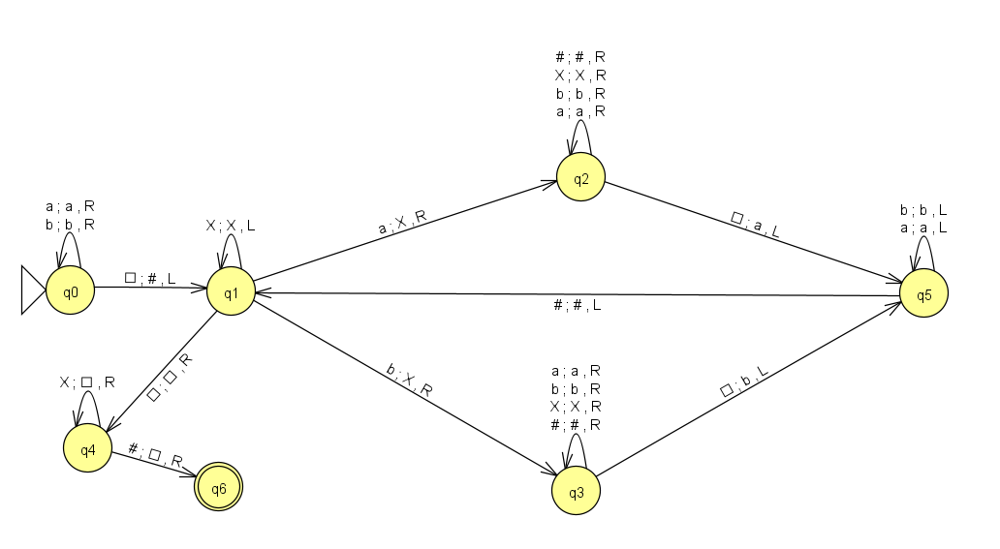

Haz clic aquí para [Descargar el archivo JFLAP](./archivos/MTC1.jff)

 

<b>*Ejemplo*</b>

Contenido inicial de la cinta

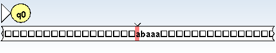

 

Contenido final de la cinta

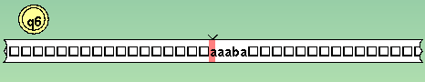

  

2 - Duplicar una cadena de aes y bes en la cinta. Ejemplo: si la MT comienza con abbaa□ en su cinta, luego de procesar su programa debe terminar con abbaa□abbaa

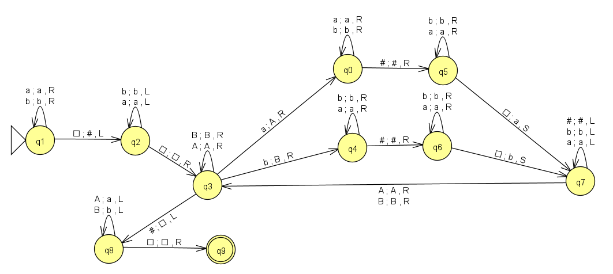

Haz clic aquí para [Descargar el archivo JFLAP](./archivos/MTC2Mejora.jff)
 
 

<b>*Ejemplo*</b>

Contenido inicial de la cinta

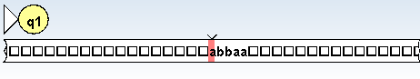

 

Contenido final de la cinta

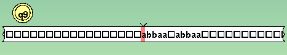

 
 

3 - Se dispone de una cinta en la que hay un número m de 1s seguido de un número n ≥ m de Aes. Se desea definir una MT que cambie las primeras m Aes por Bes. Se supone que la cabeza de la cinta inicialmente está en el 1 más a la izquierda 

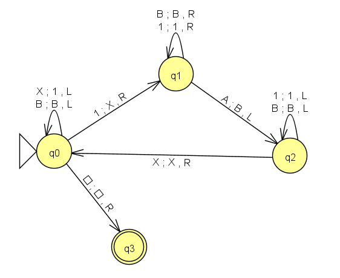

Haz clic aquí para [Descargar el archivo JFLAP](./archivos/MTC3.jff)

 

<b>*Ejemplo*</b>

Contenido inicial de la cinta

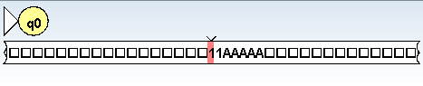

 

Contenido final de la cinta

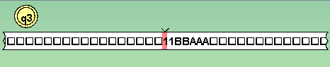

 
 

4 - Comprobar si dos palabras formadas con símbolos de Σ = {0, 1, 2} son iguales. Las dos palabras están separadas por el símbolo #

En este ejercicio, el contenido final de la cinta estará dado por el contenido original, seguida de una letra 's' si las dos palabras son iguales, o seguida de una letra 'n' si las dos palabras no lo son.

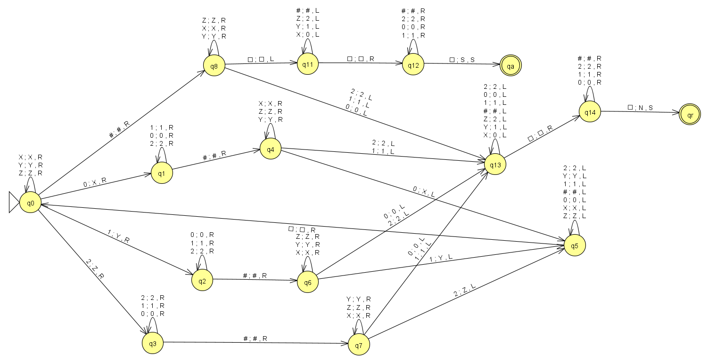

Haz clic aquí para [Descargar el archivo JFLAP](./archivos/MTC4_2.jff)

 

<b>*Ejemplos*</b>

a) 12#120 - Las palabras NO son iguales

  

Contenido inicial de la cinta

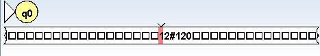

Contenido final de la cinta

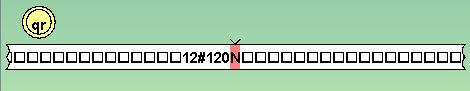

 

b) 20#01 - Las palabras NO son iguales

  

Contenido inicial de la cinta

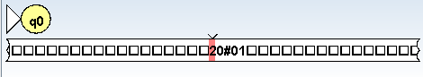

 

Contenido final de la cinta

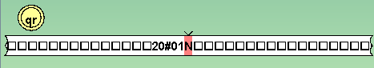

 

c) 012#012 - Las palabras SI son iguales

  

Contenido inicial de la cinta

 

Contenido final de la cinta

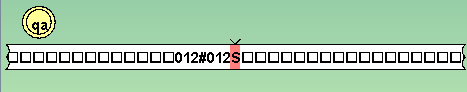

 
 

5 - Sumatoria de (n + i) , con 1 ≤ i ≤ n, con n codificado en unario

6 - [(x*y) / 2], para x, y > 0 codificados en unario

7 - x mod y, para x, y > 0, codificados en unario

8 - La parte entera superior del promedio de n números mayores que cero codificados en unario. Usar como separador de números unarios en la cinta de entrada al símbolo 0. Ejemplo: * Cinta de entrada: 111110111010 (números 5, 3 y 1) * Cinta resultado: 111 (cálculo [(5 + 3 + 1) / 3] = 3)

9 - Calcular a^nba^m -> a^(n+m)b

10 - Decidir si m < n, a^nb^m / n, m > 0, escribiendo en la cinta T (true) o F (false)

11 - Que recibe un número binario (cadena no vacía de 0’s y 1’s) y devuelve el siguiente número binario (es decir, le suma 1)

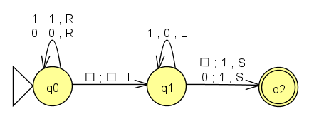

Haz clic aquí para [Descargar el archivo JFLAP](./archivos/MTC11.jff)

 

<b>*Ejemplos*</b>

a) 11

  

Contenido inicial de la cinta

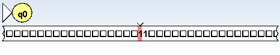

Contenido final de la cinta

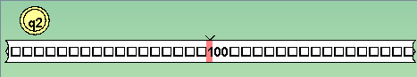

 

b) 10

  

Contenido inicial de la cinta

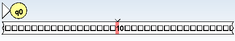

 

Contenido final de la cinta

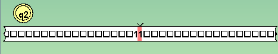

 
 

12 - Para eliminar el blanco que separa los dos argumentos x e y, moviendo los símbolos de y un lugar hacia la izquierda. Σ = {a, b}

En este ejercicio, al no encontrar la manera de ingresar un ▯ por teclado, se lo sustituyó por un guión bajo (_), y es por eso que en la transición de q0 a q1 figura con ambas formas. La primera vez que se encuentra un _ es sustituido por ▯, no afectando el funcionamiento de lo solicitado.

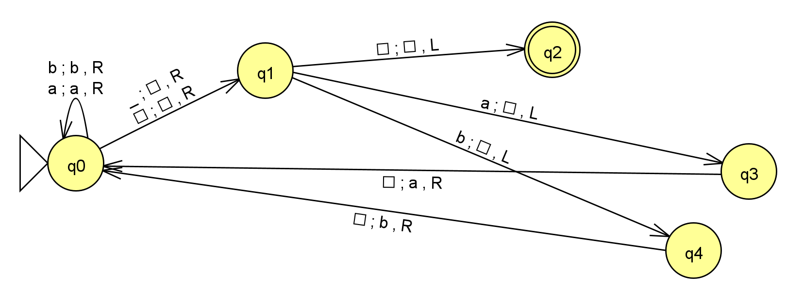

Haz clic aquí para [Descargar el archivo JFLAP](./archivos/MTC12.jff)

 

<b>*Ejemplos*</b>

a) a▯bab

  

Contenido inicial de la cinta

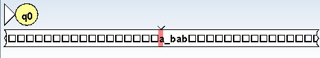

Contenido final de la cinta

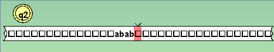

 

b)  abb▯a

  

Contenido inicial de la cinta

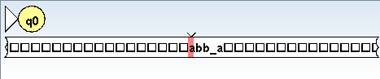

 

Contenido final de la cinta

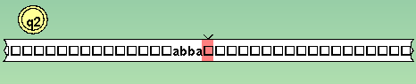

 
 

13 - MT de 3 cintas que reste el número binario de la segunda cinta del número binario de la primera y deje el resultado en la tercer cinta. Hacer otra, suponiendo que la MT es de 2 cintas y que el resultado se deja sobre la segunda. Hacerlo también para que el resultado quede en la primera

14 - MT de 3 cintas que determine si el número binario que está en la primera cinta es menor que el de la segunda. Si es menor, escribir el símbolo S sobre la tercer cinta y si no lo es, escribir los símbolos GE sobre la tercer cinta

15 - Una cinta contiene dos cadenas binarias X e Y separadas por el símbolo * tales que la longitud de cada cadena es la mínima necesaria para representar el número correspondiente (es decir, que ninguno de los números comienzan con cero). En esas condiciones construir una MT que devuelva los valores 0, 1 ó 2 según sea X = Y, X > Y o X < Y respectivamente

 

Para este ejercicio, al inicio, se lee todo el contenido ingresado, y se coloca un # al final del mismo. Al llegar a un estado final de la MT, lo siguiente al # indicará:
- con 0, que la cantidad de X es igual a la cantidad de Y
- con 1, que la cantidad de X es > a la cantidad de Y
- con 2, que la cantidad de X es < a la cantidad de Y

 

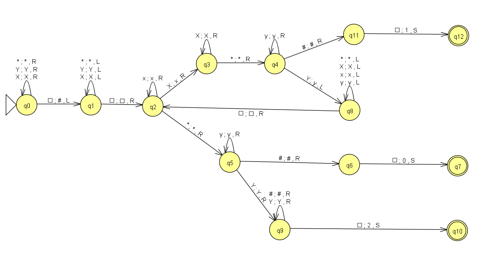

Haz clic aquí para [Descargar el archivo JFLAP](./archivos/MTC15.jff)

 

<b>*Ejemplos*</b>

a) XX*YY / Caso X = Y - Resultado 0

  

Contenido inicial de la cinta

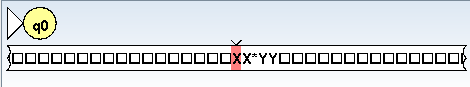

Contenido final de la cinta

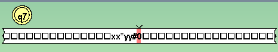

 

b) XXXX*YY / Caso X > Y - Resultado 1 

  

Contenido inicial de la cinta

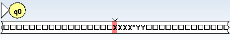

Contenido final de la cinta

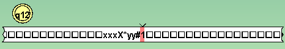

 

c) X*YYY / Caso X < Y - Resultado 2 

  

Contenido inicial de la cinta

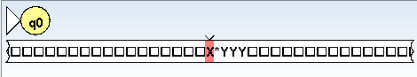

Contenido final de la cinta

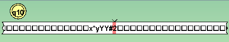

 
 

16 - Dados dos números binarios separados por el símbolo *, defina y construya una MT que calcule la suma de ambos números

Para este ejercicio, se usa la estrategia de decrementar el segundo número e incrementar el primero.

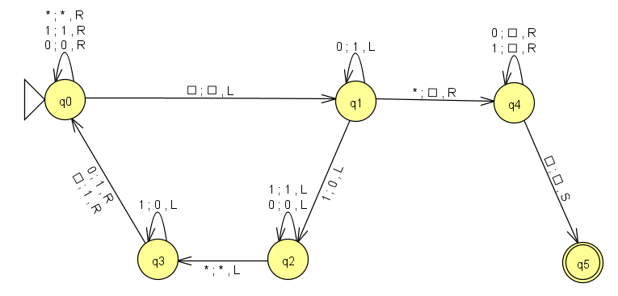

Haz clic aquí para [Descargar el archivo JFLAP](./archivos/MTC16.jff)

 

<b>*Ejemplos*</b>

a) 01*01

  

Contenido inicial de la cinta

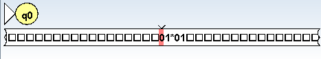

Contenido final de la cinta

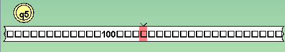

 

b) 11*101 

  

Contenido inicial de la cinta

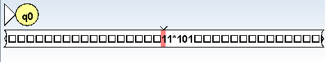

 

Contenido final de la cinta

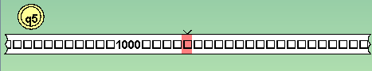

 
 

17 - Dadas dos cadenas de palotes, separadas por el símbolo * defina y construya una MT que decida si la primera cadena es submúltiplo de la segunda, y cuántas veces. Pruebe la solución hallada con las siguientes cadenas:

|||*|||||| (es submúltiplo, dos veces)

||*||||| (no es submúltiplo)

Para este ejercicio, al inicio, se lee todo el contenido ingresado, y se coloca un # al final del mismo. Al llegar a un estado final de la MT, lo siguiente al # indicará:
- con 0, que la primer cadena no es submúltiplo de la segunda.
- con 1, la cantidad de veces que la primer cadena es submúltiplo de la segunda.

 
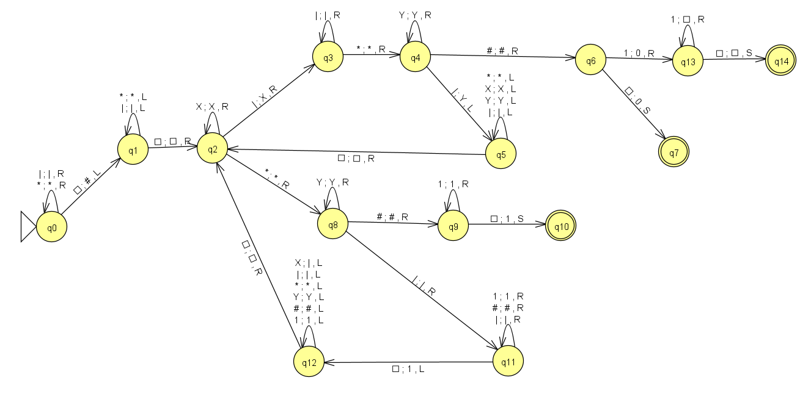

Haz clic aquí para [Descargar el archivo JFLAP](./archivos/MTC17.jff)

 

<b>*Ejemplos*</b>

a) | | | * | | - No es submúltiplo 

  

Contenido inicial de la cinta

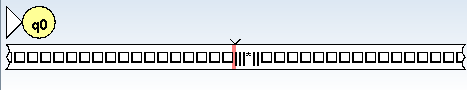

Contenido final de la cinta

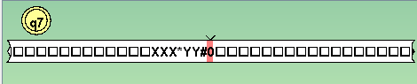

 

b) | | | * | | | | | | - Es submúltiplo, 2 veces 

  

Contenido inicial de la cinta

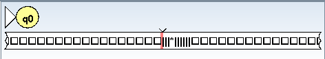

Contenido final de la cinta

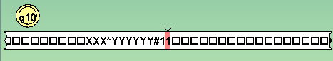

 

c) | |  * | | | | |  - No es submúltiplo

  

Contenido inicial de la cinta

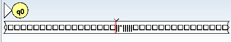

Contenido final de la cinta

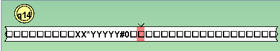

 
 

18 - f(x, y)

0 si x <= y

x-y si x > y

x e y codificados en unario

x e y se encuentran en C1 separados por un símbolo cero

resultado de f(x, y) se dejará en C4

C2 se colocará c y en C3 y

Ejemplo x = 5 y = 3

C1: ...□111110111□...

C2: ...□11111□□□□□...

C3: ...□111□□□□□□□...

C4: ...□11□□□□□□□□...

 
 
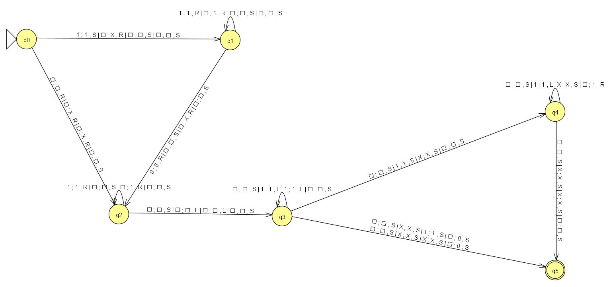

Haz clic aquí para [Descargar el archivo JFLAP](./archivos/MTC18.jff)

 

<b>*Ejemplos*</b>

a) 111110111 - Según apunte x=5,y=3 

  

Contenido inicial de la cinta

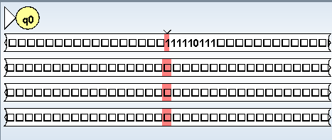

Contenido final de la cinta

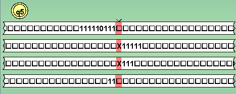

 
No coincide con el ejemplo.
