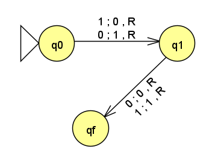
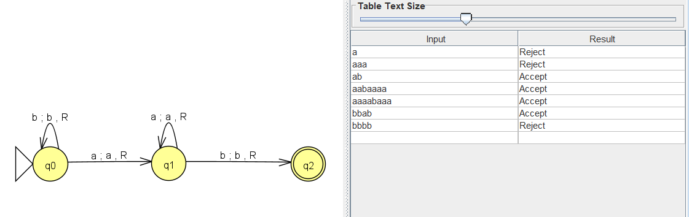
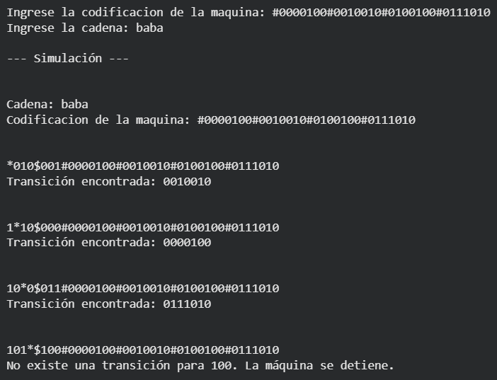
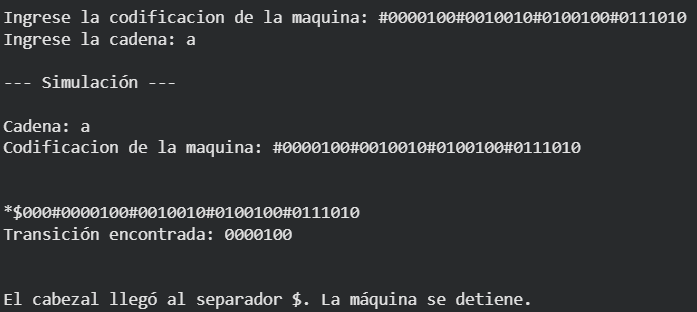

## Actividad 5

## TP Máquina de Turing Universal

<p>1 - ¿Por qué se dice que una MTU es capaz de simular cualquier Máquina de Turing? </p>

<p align="justify">
Se dice que una Máquina de Turing Universal (MTU) es capaz de simular cualquier Máquina de Turing porque puede recibir como entrada la descripción codificada de otra máquina, junto con la cadena que esta debe procesar. A partir de esta información, la MTU interpreta sus estados y reglas de transición y reproduce paso a paso su funcionamiento.
De esta manera, no es necesario construir una máquina diferente para cada problema, ya que una misma MTU puede ejecutar distintos algoritmos dependiendo de la máquina que se le proporcione como entrada. Esta idea constituye uno de los fundamentos teóricos de las computadoras de propósito general, donde tanto los programas como los datos pueden representarse y almacenarse como información.
</p>
<br>

<p>2 - Suponer que se tiene una MT M que acepta todas las cadenas que terminan en 01. Indicar qué debería hacer una MTU con las siguientes entradas. Explicar en cada caso si la MTU acepta o rechaza y por qué</p>

* U(⟨M⟩,1101)
* U(⟨M⟩,100)
* U(⟨M⟩,01)
* U(⟨M⟩,111)

<p  align="justify">
La Máquina de Turing Universal (MTU) recibe como entrada la descripción codificada de la máquina M, representada como ⟨M⟩, junto con la cadena que debe procesar. En cada caso, la MTU simula el comportamiento de M sobre dicha cadena. Como M acepta todas las cadenas que finalizan en 01, se obtiene que:
</p>

* U(⟨M⟩, 1101):<span style="color: green;"> Acepta</span>, porque la cadena 1101 finaliza en 01.
* U(⟨M⟩, 100):<span style="color: red;"> Rechaza</span>, porque la cadena 100 no finaliza en 01.
* U(⟨M⟩, 01):<span style="color: green;"> Acepta</span>, porque la cadena 01 finaliza en 01.
* U(⟨M⟩, 111):<span style="color: red;"> Rechaza</span>, porque la cadena 111 no finaliza en 01.

Por lo tanto, la MTU obtiene en cada caso el mismo resultado que obtendría M al procesar directamente cada una de las cadenas, ya que su función es simular el comportamiento de la máquina M a partir de su descripción.

<br>

<p>3 - Dada la siguiente MT M:</p>


|Q	|0|	1|
|:---:|:---:|:---:|
|q0	|(q1,1,R)	|(q1,0,R)|
|q1	|(qf,0,R)	|(qf,1,R)|
|qf|	-|	-|

<p>a) Explicar que hace M</p>

<p  align="justify">
La máquina M invierte el primer símbolo de la cadena de entrada: si lee 0, lo reemplaza por 1, y si lee 1, lo reemplaza por 0. Luego avanza hacia la derecha y lee el segundo símbolo sin alterar su valor, pasando finalmente al estado de aceptación qf.
Para que la máquina alcance el estado qf, la cadena debe contener como mínimo dos símbolos. Si la entrada tiene solamente un símbolo (0 o 1), luego de procesarlo la máquina queda en q1 leyendo un blanco. Como no existe una transición definida para ese caso, se detiene sin alcanzar el estado final.
</p>



<br>
<p>b) Explicar qué información debería recibir una MTU para poder simular M</p>

<div align="justify">
Para poder simular a M, la MTU debe recibir una codificación de la máquina M, y la cadena de entrada w que se desea procesar.
La codificación de M, debe contener la información necesaria para describir su funcionamiento: el alfabeto de entrada y de cinta, los estados y la función de transición. Estos elementos se representan mediante una codificación que la MTU pueda interpretar.
Por lo tanto, la entrada de la MTU puede representarse como: </div>
<div  align="center">(⟨M⟩,w)</div>
<div  align="justify">
donde ⟨M⟩ corresponde a la descripción codificada de la máquina M y w es la cadena sobre la cual se realizará la simulación. A partir de esta información, la MTU puede reproducir paso a paso el comportamiento de M.
</div>
<br>

<p>c) Codificar la cinta de MTU sabiendo que configuración de la cinta de MT M es 1 q0 0 1 1</p>

Para codificar la cinta, debemos realizar la codificación de la MT.
A partir de la información de la MT, realizamos la codificación de los símbolos, estados y movimientos.

*MT original:*
|Q	|0|	1|
|:---:|:---:|:---:|
|q0	|(q1,1,R)	|(q1,0,R)|
|q1	|(qf,0,R)	|(qf,1,R)|
|qf|	-|	-|

<br>

*Codificación de los símbolos:*

<p>0 = 0, 1 = 1</p>

<br>

*Codificación de los estados:*

<p>q0 = 00, q1 = 01, qf = 10</p>

<br>

*Codificación de los movimientos:*

<p>L = 1, R = 0</p>

<br>

*Codificación de M:*

|Q	|0|	1|
|:---:|:---:|:---:|
|00	|(01,1,0)	|(01,0,0)|
|01	|(10,0,0)	|(10,1,0)|
|10|	-|	-|

<br>

*⟨M⟩*

#0000110#0010100#0101000#0111010

<br>

*Codificación de la cinta de MTU sabiendo que configuración de la cinta de MT M es 1 q0 0 1 1*

En este caso, la máquina se encuentra en el estado q0, y el símbolo sobre el que se encuentra la cabeza es el 0. La palabra de la cinta que precede a la celda sobre la que se encuentra la cabeza de entrada/salida es 1, y la que se encuentra a continuación de la misma es 11.

Por lo tanto, la codificación de la cinta de MTU es la siguiente:

1*11$000#0000110#0010100#0101000#0111010

<br>

<hr>


### 1 - Codificación de una máquina simple

**Definir una máquina *M*... que obre el alfabeto {a,b}, acepte palabras que que contengan la subcadena "ab"**

#### JFLAP



Haz clic aquí para [Descargar el archivo JFLAP](./archivos/MTab.jff)


#### Definición formal
```
MT  = < Γ = {a,b,▯},
        Σ = {a,b},
        b = {▯},
        Q = {q0,q1,q2},
        q0 = q0,
        F = {q2},
        δ = { 
              δ(q0,a)=(q1,a,R),
              δ(q0,b)=(q0,b,R),
              δ(q1,a)=(q1,a,R),
              δ(q1,b)=(q2,b,R)
            }
      >
```
#### Matriz de transiciones

| δ  | a   | b   |
|:--:|:---:|:---:|
| >q0 | q1,a,R | q0,b,R |
| q1 | q1,a,R | q2,b,R | 
| *q2  | -   | -   | 

<br>

**Codificar sus estados, símbolos y transiciones en forma numérica**

<br>

*Codificación de los estados:*

<p>q0 = 00, q1 = 01, q2 = 10</p>

*Codificación de los símbolos:*

<p>a = 0, b = 1</p>

<br>

*Codificación de los movimientos:*

<p>L = 1, R = 0</p>

<br>

*Codificación de M:*

|Q	|0|	1|
|:---:|:---:|:---:|
|00	|(01,0,0)	|(00,1,0)|
|01	|(01,0,0)	|(10,1,0)|
|10|	-|	-|

<br>

*⟨M⟩*

#0000100#0010010#0100100#0111010

<br>

*Ejemplo codificación MTU recibiendo "baba" como cadena*

*010$001#0000100#0010010#0100100#0111010

<br>

*Simulación paso a paso*

*010$001#0000100#0010010#0100100#0111010
1*10$000#0000100#0010010#0100100#0111010
10*0$011#0000100#0010010#0100100#0111010
101*$100#0000100#0010010#0100100#0111010

<br>

### 2 - Simulación básica

* Implementar en Python un programa que reciba
  
  - La codificación de una máquina 
    <math xmlns="http://www.w3.org/1998/Math/MathML">
      <mi>M</mi>
    </math>

  - Una cadena de entrada 
    <math xmlns="http://www.w3.org/1998/Math/MathML">
      <mi>w</mi>
    </math>

* El programa debe simular paso a paso la ejecución de
  <math xmlns="http://www.w3.org/1998/Math/MathML">
    <mi>M</mi>
  </math> 
    sobre
  <math xmlns="http://www.w3.org/1998/Math/MathML">
    <mi>w</mi>
  </math>

  <br>

Hecha especialmente para esta MT. Falta ajustar para cualquier MT.
```
def codificar_cadena(cadena):
    # Convierte la cadena de entrada a la codificación utilizada por la MTU.
    # a = 0
    # b = 1

    cadena_codificada = ""

    for simbolo in cadena:
        if simbolo == "a":
            cadena_codificada += "0"
        elif simbolo == "b":
            cadena_codificada += "1"

    return cadena_codificada


def cargar_transiciones(codificacion):
    # Separa la codificación de M en sus distintas transiciones.

    return codificacion.split("#")


def buscar_transicion(transiciones, estado, simbolo):
    # Busca una transición que coincida con el estado actual
    # y el símbolo leído. Si no la encuentra, devuelve None

    trans_a_buscar = estado + simbolo

    for transicion in transiciones:
        if transicion.startswith(trans_a_buscar):
            return transicion

    return None

def decodificar_transicion(transicion):
    #Divide una transición codificada en:
    #estado actual, símbolo leído, estado siguiente,
    #símbolo escrito y movimiento.

    estado_actual = transicion[0:2] # Posición 0 y 1
    simbolo_leido = transicion[2] # Posición 2
    estado_siguiente = transicion[3:5] # Posición 3 y 5
    simbolo_escrito = transicion[5] # Posición 5
    movimiento = transicion[6] # Posición 6

    return estado_actual, simbolo_leido, estado_siguiente, simbolo_escrito, movimiento


def mostrar_configuracion(cinta, posicion, estado,codificacion_m ):
    # Muestra el estado actual de la simulación.

    cinta_mostrar = cinta.copy()
    caracter_leido = cinta[posicion]
    cinta_mostrar[posicion] = "*"
    print("".join(cinta_mostrar)+"$"+ estado + caracter_leido + codificacion_m, "\t")


def ejecutar_transicion(cinta, posicion, transicion):
    # Escribe el nuevo símbolo, mueve el cabezal y
    # devuelve el nuevo estado y posición.

    _, _, estado_siguiente, simbolo_escrito, movimiento = decodificar_transicion(transicion)

    cinta[posicion] = simbolo_escrito

    if movimiento == "0":       # Derecha
        posicion += 1
    elif movimiento == "1":     # Izquierda
        posicion -= 1

    return posicion, estado_siguiente


def main():

    # Codificacion de la maquina: #0000100#0010010#0100100#0111010
    codificacion_m = input("Ingrese la codificacion de la maquina: ")
    # cadena: baba
    cadena = input("Ingrese la cadena: ")

    # Codificar la cadena
    cinta = list(codificar_cadena(cadena))

    # Obtener las transiciones de M
    transiciones = cargar_transiciones(codificacion_m)

    # Configuración inicial
    estado = "00"
    posicion = 0

    print("\n--- Simulación ---\n")

    print(f"Cadena: {cadena}")
    print(f"Codificacion de la maquina: {codificacion_m}\n\n")

    while True:

        mostrar_configuracion(cinta, posicion, estado, codificacion_m)

        simbolo = cinta[posicion]

        transicion = buscar_transicion(transiciones,estado,simbolo)

        # Si no existe una transición, M se detiene
        if transicion is None:
            print(f"No existe una transición para {estado + simbolo}. La máquina se detiene.\n")
            break

        print("Transición encontrada:", transicion, "\n\n")

        posicion, estado = ejecutar_transicion(cinta,posicion,transicion)

        if posicion >= len(cinta):
          print("El cabezal llegó al separador $. La máquina se detiene.")
          break

        if posicion < 0:
          print("El cabezal salió del límite izquierdo de la cadena. La máquina se detiene.")
          break

main()

```

Link a Google Colab
🔗 (https://colab.research.google.com/drive/1dyg4cI9e_Lc4GbeGnbhxOrYqnuc8MIMb?usp=sharing)


### 3 - Pruebas de funcionamiento

* Probar la simulación con diferentes entradas

* Documentar los resultados

<br>

*Caso 1*



<br>

*Caso 2*



<br>

*Caso 3*


### 4 - Informe final

* Explicar la codificación utilizada

* Mostrar ejemplos de ejecución

* Reflexionar sobre la relación entre la MTU y las computadoras modernas