## Actividad 5

## TP Máquina de Turing Universal

<p>1 - ¿Por qué se dice que una MTU es capaz de simular cualquier Máquina de Turing? </p>

<p align="justify">
Se dice que una Máquina de Turing Universal (MTU) es capaz de simular cualquier Máquina de Turing porque puede recibir como entrada la descripción codificada de otra máquina, junto con la cadena que esta debe procesar. A partir de esta información, la MTU interpreta sus estados y reglas de transición y reproduce paso a paso su funcionamiento.
De esta manera, no es necesario construir una máquina diferente para cada problema, ya que una misma MTU puede ejecutar distintos algoritmos dependiendo de la máquina que se le proporcione como entrada. Esta idea constituye uno de los fundamentos teóricos de las computadoras de propósito general, donde tanto los programas como los datos pueden representarse y almacenarse como información.
</p>
<br>

<p>2 - Suponer que se tiene una MT M que acepta todas las cadenas que terminan en 01. Indicar qué debería hacer una MTU con las siguientes entradas. Explicar en cada caso si la MTU acepta o rechaza y por qué</p>

* U(⟨M⟩,1101)
* U(⟨M⟩,100)
* U(⟨M⟩,01)
* U(⟨M⟩,111)

<p  align="justify">
La Máquina de Turing Universal (MTU) recibe como entrada la descripción codificada de la máquina M, representada como ⟨M⟩, junto con la cadena que debe procesar. En cada caso, la MTU simula el comportamiento de M sobre dicha cadena. Como M acepta todas las cadenas que finalizan en 01, se obtiene que:
</p>

* U(⟨M⟩, 1101):<span style="color: green;"> Acepta</span>, porque la cadena 1101 finaliza en 01.
* U(⟨M⟩, 100):<span style="color: red;"> Rechaza</span>, porque la cadena 100 no finaliza en 01.
* U(⟨M⟩, 01):<span style="color: green;"> Acepta</span>, porque la cadena 01 finaliza en 01.
* U(⟨M⟩, 111):<span style="color: red;"> Rechaza</span>, porque la cadena 111 no finaliza en 01.

Por lo tanto, la MTU obtiene en cada caso el mismo resultado que obtendría M al procesar directamente cada una de las cadenas, ya que su función es simular el comportamiento de la máquina M a partir de su descripción.

<br>

<p>3 - Dada la siguiente MT M:</p>


|Q	|0|	1|
|:---:|:---:|:---:|
|q0	|(q1,1,R)	|(q1,0,R)|
|q1	|(qf,0,R)	|(qf,1,R)|
|qf|	-|	-|

<p>a) Explicar que hace M</p>

<p  align="justify">
La máquina M invierte el primer símbolo de la cadena de entrada: si lee 0, lo reemplaza por 1, y si lee 1, lo reemplaza por 0. Luego avanza hacia la derecha y lee el segundo símbolo sin alterar su valor, pasando finalmente al estado qf.
Para que la máquina alcance el estado qf, la cadena debe contener como mínimo dos símbolos. Si la entrada tiene solamente un símbolo (0 o 1), luego de procesarlo la máquina queda en q1 leyendo un blanco. Como no existe una transición definida para ese caso, se detiene sin alcanzar el estado qf.
</p>

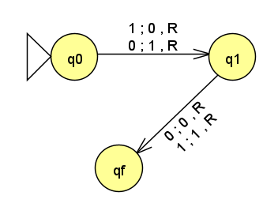

<br>
<p>b) Explicar qué información debería recibir una MTU para poder simular M</p>

<div align="justify">
Para poder simular a M, la MTU debe recibir una codificación de la máquina M, y la cadena de entrada w que se desea procesar.
La codificación de M, debe contener la información necesaria para describir su funcionamiento: el alfabeto de entrada y de cinta, los estados y la función de transición. Estos elementos se representan mediante una codificación que la MTU pueda interpretar.
Por lo tanto, la entrada de la MTU puede representarse como: </div>
<div  align="center">(⟨M⟩,w)</div>
<div  align="justify">
donde ⟨M⟩ corresponde a la descripción codificada de la máquina M y w es la cadena sobre la cual se realizará la simulación. A partir de esta información, la MTU puede reproducir paso a paso el comportamiento de M.
</div>
<br>

<p>c) Codificar la cinta de MTU sabiendo que configuración de la cinta de MT M es 1 q0 0 1 1</p>

Para codificar la cinta, debemos realizar la codificación de la MT.
A partir de la información de la MT, realizamos la codificación de los símbolos, estados y movimientos.

*MT original:*
|Q	|0|	1|
|:---:|:---:|:---:|
|q0	|(q1,1,R)	|(q1,0,R)|
|q1	|(qf,0,R)	|(qf,1,R)|
|qf|	-|	-|

<br>

*Codificación de los símbolos:*

<p>0 = 0, 1 = 1</p>

<br>

*Codificación de los estados:*

<p>q0 = 00, q1 = 01, qf = 10</p>

<br>

*Codificación de los movimientos:*

<p>L = 1, R = 0</p>

<br>

*Matriz de transiciones codificada:*

|Q	|0|	1|
|:---:|:---:|:---:|
|00	|(01,1,0)	|(01,0,0)|
|01	|(10,0,0)	|(10,1,0)|
|10|	-|	-|

<br>

*⟨M⟩*

#0000110#0010100#0101000#0111010

Esto se obtiene a través de la codificación de cada transición, y es representado por el estado actual, el símbolo leído, el nuevo estado, el símbolo escrito y el movimiento de la cabeza.

<br>

*Codificación de la cinta de MTU sabiendo que configuración de la cinta de MT M es 1 q0 0 1 1*

En este caso, la máquina se encuentra en el estado q0, y el símbolo sobre el que se encuentra la cabeza es el 0. La palabra de la cinta que precede a la celda sobre la que se encuentra la cabeza de entrada/salida es 1, y la que se encuentra a continuación de la misma es 11.

Por lo tanto, la codificación de la cinta de MTU en ese momento es la siguiente:

1*11$000#0000110#0010100#0101000#0111010

Esta codificación puede dividirse en 3 partes:
<br>
* Lo anterior al signo $ representa una entrada codificada en la cinta, y el * el símbolo sobre la cual la cabeza de lectura/escritura se encuentra posicionada en ese momento

* Lo que se encuentra entre $ y el primer #, que corresponden al estado actual codificado seguido del caracter leido (00 y 0)

* Lo que empieza con #, que corresponde a la codificación de las transiciones, utilizando # como separador entre las mismas.

<br>
<hr>


### 1 - Codificación de una máquina simple

**Definir una máquina *M*... que sobre el alfabeto {a,b}, acepte palabras que que contengan la subcadena "ab"**

#### JFLAP

Esta MT agrega al final de la palabra ingresada un caracter 's', o un caracter 'n', que indica si la palabra es aceptada o no aceptada por la misma.

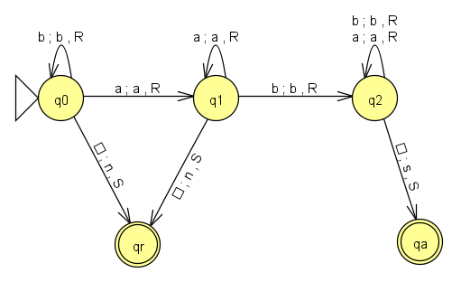

<br>

Haz clic aquí para [Descargar el archivo JFLAP](./archivos/MTab_2.jff)

<br>

#### Definición formal
```
MT  = < Γ = {a,b,▯,s,n},
        Σ = {a,b},
        b = {▯},
        Q = {q0,q1,q2,qa,qr},
        q0 = q0,
        F = {qa,qr},
        δ = { 
              δ(q0,a)=(q1,a,R),
              δ(q0,b)=(q0,b,R),
              δ(q0,▯)=(qr,n,S),
              δ(q1,a)=(q1,a,R),
              δ(q1,b)=(q2,b,R),
              δ(q1,▯)=(qr,n,S),
              δ(q2,a)=(q2,a,R),
              δ(q2,b)=(q2,b,R),
              δ(q2,▯)=(qa,s,S),
            }
      >
```
#### Matriz de transiciones

| δ  | a   | b   | ▯   | s   | n |
|:--:|:---:|:---:|:---:|:---:|:---:|
| >q0 | q1,a,R | q0,b,R | qr,n,S | - | - |
| q1 | q1,a,R | q2,b,R | qr,n,S | - | - |
| q2  | q2,a,R | q2,b,R | qa,s,S | - | - |
| qa| - | - | - | - | - |
| qr| - | - | - | - | - |

<br>

**Codificar sus estados, símbolos y transiciones en forma numérica**

<br>

*Codificación de los estados:*

| Estado  | Codificación |
|:--:|:---:|
| q0  | 000 |
| q1  | 001 |
| q2  | 010 |
| qa  | 011 |
| qr  | 100 |

<br>

*Codificación de los símbolos:*

| Símbolo  | Codificación |
|:--:|:---:|
| a  | 000 |
| b  | 001 |
| ▯  | 010 |
| s  | 011 |
| n  | 100 |

<br>

*Codificación de los movimientos:*

| Movimiento  | Codificación |
|:--:|:---:|
| R  | 000 |
| L  | 001 |
| S  | 010 |

<br>

*Matriz de transiciones de M Codificada*

| δ  | 000   | 001   | 010   | 011   | 100 |
|:--:|:---:|:---:|:---:|:---:|:---:|
| 000 | 001,000,000 | 000,001,000 | 100,100,010 | - | - |
| 001 | 001,000,000 | 010,001,000 | 100,100,010 | - | - |
| 010  | 010,000,000 | 010,001,000 | 011,011,010 | - | - |
| 011| - | - | - | - | - |
| 100| - | - | - | - | - |


<br>

*⟨M⟩*

<div>#000000001000000#000001000001000#000010100100010#001000001000000#001001010001000 _</div>
<div>#001010100100010#010000010000000#010001010001000#010010011011010</div>
<br>

*Ejemplo codificación MTU recibiendo "baba" como cadena*

<div>Codificación de la cadena: 001000001000</div>
<br>
<div>***000001000$000001#000000001000000#000001000001000#000010100100010#001000001000000#001001010001000 _</div>
<div>#001010100100010#010000010000000#010001010001000#010010011011010</div>

<br>
<br>

*Simulación paso a paso*

<div>***000001000$<span style="color: grey">000001</span>#000000001000000#<span style="color: grey">000001</span><span style="color: green">000001000</span>#000010100100010#001000001000000#001001010001000 _</div>
<div>#001010100100010#010000010000000#010001010001000#010010011011010</div>
<br>
<div>Busca la primera transición codificada de ⟨M⟩ que comience con 000001</div>
<p>Encuentra <span style="color: grey">000001</span><span style="color: green">000001000</span>, que se corresponderá con el estado actual (3 caracteres - 000), el símbolo que leyó (3 caracteres - 001), el estado al que transiciona (3 caracteres - 000), el símbolo con el que se reemplaza la posición actual del cabezal (3 caracteres - 001) y el movimiento que este tiene que realizar (3 caracteres - 000).</p>
<br>
<div>001***001000$<span style="color: grey">000000</span>#<span style="color: grey">000000</span><span style="color: green">001000000</span>#000001000001000#000010100100010#001000001000000#001001010001000 _</div>
<div>#001010100100010#010000010000000#010001010001000#010010011011010</div>
<br>
<div>001000***000$<span style="color: grey">001001</span>#000000001000000#000001000001000#000010100100010#001000001000000<span style="color: grey">001001</span> 
<span style="color: green">#010001000</span> _</div>
<div>#001010100100010#010000010000000#010001010001000#010010011011010</div>
<br>
<div>001000001***$<span style="color: grey">010000</span>#000000001000000#000001000001000#000010100100010#001000001000000#001001010001000 _</div>
<div>#001010100100010#<span style="color: grey">010000</span><span style="color: green">010000000</span>#010001010001000#010010011011010
</div>
<br>
<div>001000001000***$<span style="color: grey">010010</span>#000000001000000#000001000001000#000010100100010#001000001000000#001001010001000 _</div>
<div>#001010100100010#010000010000000#010001010001000#<span style="color: grey">010010</span><span style="color: green">011011010</span></div>
<br>
<div>001000001000***$<span style="color: grey">011011</span>#000000001000000#000001000001000#000010100100010#001000001000000#001001010001000 _</div>
<div>#001010100100010#010000010000000#010001010001000#010010011011010</div>
<br>
<div>Como no encuentra ninguna transición que comience con 011011, no realiza ninguna iteración más. El contenido final de la cinta es:</div>
<div><span style="color: grey">001</span><span style="color: green">000</span><span style="color: grey">001</span><span style="color: green">000</span><span style="color: grey">011</span></div>
<br>
<div>Que decodificado es: babas. </div>
<div>La MT codificada, agregaba un caracter 's' o 'n' al final de la palabra ingresada, para indicar si la palabra era aceptada o rechazada por la MT. En este caso, la palabra es aceptada.

<br>
<br>
<br>

*Ejemplo codificación MTU recibiendo "b" como cadena*

<div>Codificación de la cadena: 001</div>
<br>

*Simulación paso a paso*
<br>
<div>***$<span style="color: grey">000001</span>#000000001000000#<span style="color: grey">000001</span><span style="color: green">000001000</span>#000010100100010#001000001000000#001001010001000 _</div>
<div>#001010100100010#010000010000000#010001010001000#010010011011010</div>
<br>
<div>001***$<span style="color: grey">000010</span>#000000001000000#000001000001000#<span style="color: grey">000010</span><span style="color: green">100100010</span>#001000001000000#001001010001000 _</div>
<div>#001010100100010#010000010000000#010001010001000#010010011011010</div>
<br>
<div>001***$<span style="color: grey">100100</span>#000000001000000#000001000001000#000010100100010#001000001000000#001001010001000 _</div>
<div>#001010100100010#010000010000000#010001010001000#010010011011010</div>
<br>
<div>Como no encuentra ninguna transición que comience con 100100, no realiza ninguna iteración más. El contenido final de la cinta es:</div>
<div><span style="color: grey">001</span><span style="color: green">100</span>
<br>
<div>Que decodificado es: bn. </div>
<div>La MT codificada, agregaba un caracter 's' o 'n' al final de la palabra ingresada, para indicar si la palabra era aceptada o rechazada por la MT. En este caso, la palabra es rechazada.
<br>
<br>

### 2 - Simulación básica

* Implementar en Python un programa que reciba
  
  - La codificación de una máquina 
    <math xmlns="http://www.w3.org/1998/Math/MathML">
      <mi>M</mi>
    </math>

  - Una cadena de entrada 
    <math xmlns="http://www.w3.org/1998/Math/MathML">
      <mi>w</mi>
    </math>

* El programa debe simular paso a paso la ejecución de
  <math xmlns="http://www.w3.org/1998/Math/MathML">
    <mi>M</mi>
  </math> 
    sobre
  <math xmlns="http://www.w3.org/1998/Math/MathML">
    <mi>w</mi>
  </math>

  <br>

```
def cargar_transiciones(codificacion):
    # Separa la codificación de M en sus distintas transiciones.

    return codificacion.lstrip("#").split("#")


def buscar_transicion(transiciones, estado, simbolo):
    # Busca una transición que coincida con el estado actual
    # y el símbolo leído. Si no la encuentra, devuelve None

    trans_a_buscar = estado + "".join(simbolo)

    for transicion in transiciones:
        if transicion.startswith(trans_a_buscar):
            return transicion

    return None

def decodificar_transicion(transicion, cant_car_estado, cant_car_simbolo):
    # Divide una transición codificada en:
    # estado actual, símbolo leído, estado siguiente,
    # símbolo escrito y movimiento.

    estado_actual = transicion[0:cant_car_estado]
    print(f"Estado actual: {estado_actual}")
    simbolo_leido = transicion[cant_car_estado:cant_car_estado+cant_car_simbolo]
    print(f"Simbolo leido: {simbolo_leido}")
    estado_siguiente = transicion[cant_car_estado+cant_car_simbolo:(cant_car_estado*2)+cant_car_simbolo]
    print(f"Estado siguiente: {estado_siguiente}")
    simbolo_escrito = transicion[(cant_car_estado*2)+cant_car_simbolo:((cant_car_estado+cant_car_simbolo)*2)]
    print(f"Símbolo a escribir: {simbolo_escrito}")
    movimiento = transicion[(cant_car_estado+cant_car_simbolo)*2:]
    print(f"Movimiento: {movimiento}\n")

    return estado_actual, simbolo_leido, estado_siguiente, simbolo_escrito, movimiento


def mostrar_configuracion(cinta, posicion_cabezal, cant_car_simbolo, estado, codificacion_m):
    # Muestra el estado actual de la simulación.

    cinta_mostrar = cinta.copy()
    simbolo_leido = cinta[posicion_cabezal:posicion_cabezal+cant_car_simbolo]
    cinta_mostrar[posicion_cabezal:posicion_cabezal + cant_car_simbolo] = (["*"] * cant_car_simbolo)
    print("".join(cinta_mostrar)+"$"+ estado + "".join(simbolo_leido) + codificacion_m, "\n")

def ejecutar_transicion(cinta, posicion_cabezal, cant_car_estado, cant_car_simbolo, transicion, derecha, izquierda):
    # Escribe el nuevo símbolo, mueve el cabezal y devuelve el nuevo estado y posición.

    _, _, estado_siguiente, simbolo_escrito, movimiento = decodificar_transicion(transicion, cant_car_estado, cant_car_simbolo)

    # Escribe el símbolo por el que se reemplaza los *** en la cinta
    cinta[posicion_cabezal:posicion_cabezal + cant_car_simbolo] = list(simbolo_escrito)

    if movimiento == derecha: # Derecha
        posicion_cabezal += 1 * cant_car_simbolo
    elif movimiento == izquierda: # Izquierda
        posicion_cabezal -= 1 * cant_car_simbolo
    # En caso de un Stay, no modifica la posicion del cabezal

    return posicion_cabezal, estado_siguiente

def main():

    codificacion_m = input("Ingrese la codificacion de la maquina (Formato #<transicionCodificada>#<tc>...): ")
    cadena_codificada = input("\nIngrese la cadena codificada: ")
    cant_car_estado = int(input ("\nIngrese la cantidad de caracteres que ocupa el estado: "))
    cant_car_simbolo  = int(input ("\nIngrese la cantidad de caracteres que ocupa el símbolo: "))
    simbolo_blanco  = input ("\nIngrese la codificacion del simbolo blanco: ")
    derecha  = input ("\nIngrese la codificacion del movimiento RIGHT: ")
    izquierda  = input ("\nIngrese la codificacion del movimiento LEFT: ")

    # Transforma la cadena codificada en una lista
    cinta = list(cadena_codificada)

    # Obtiene una las transiciones de M
    transiciones = cargar_transiciones(codificacion_m)

    # -- Configuración inicial -- #
    # Posición inicial del cabezal
    posicion_cabezal = 0
    # Estado inicial
    estado = transiciones[0][posicion_cabezal:posicion_cabezal+cant_car_estado]

    print("\n\n--- Simulación ---\n")

    print(f"Cadena codificada: {cadena_codificada}")
    print(f"Codificacion de la maquina: {codificacion_m}\n\n")

    while True:

        mostrar_configuracion(cinta, posicion_cabezal, cant_car_simbolo, estado, codificacion_m)

        simbolo = cinta[posicion_cabezal:posicion_cabezal + cant_car_simbolo]

        transicion = buscar_transicion(transiciones, estado, simbolo)


        # Si no existe una transición, M se detiene
        if transicion is None:
            print(f"No existe una transición para {estado + "".join(simbolo)}. La máquina se detiene.\n")
            print(f"Estado final de la cinta: {"".join(cinta)}")
            break

        print("Transición encontrada:", transicion, "\n")
        posicion_cabezal, estado = ejecutar_transicion(cinta, posicion_cabezal, cant_car_estado, cant_car_simbolo, transicion, derecha, izquierda)

        # Si al ejecutar la transicion se fue del limite derecho de la lista, 
        # agrega un símbolo blanco al final de la misma

        if posicion_cabezal >= len(cinta):
            cinta.extend(simbolo_blanco)

        # Si al ejecutar la transicion se fue del limite izquierdo de la lista, 
        # agrega un símbolo blanco al inicio de la misma y reposiciona el cabezal

        if posicion_cabezal < 0:
            cinta[:0] = list(simbolo_blanco)
            posicion_cabezal = 0

main()
```

Link a Google Colab
🔗 (https://colab.research.google.com/drive/14NSc1h79xVtPm6FBXoFygfAu1cNzvj_8?usp=sharing)

<br>

### 3 - Pruebas de funcionamiento

* Probar la simulación con diferentes entradas

* Documentar los resultados


<br>

*Caso 1 - **"baba"** - Acepta la palabra*

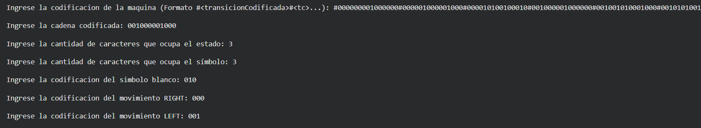
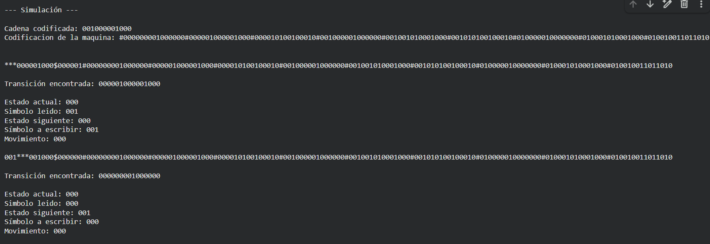
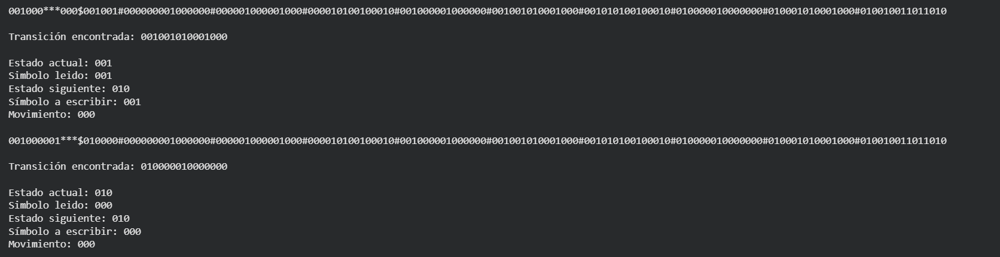
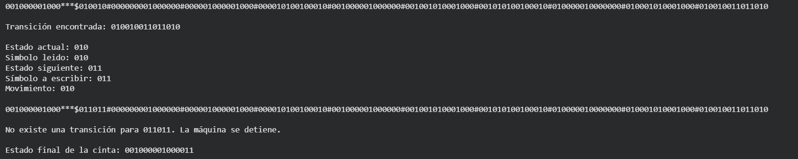

<br>
<div>El contenido final de la cinta es: 001000001000011</div>
<div>Según la codificación utilizada se corresponde con: babas (la palabra original, seguida de una s, que indica que la palabra es aceptada).</div>

<br>
<br>

*Caso 2 - **"b"** - No acepta la palabra*

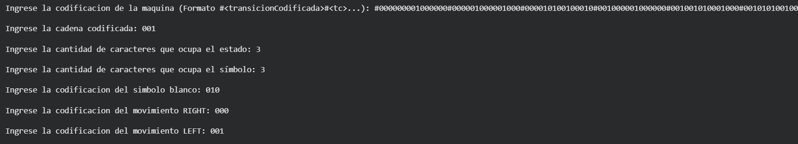
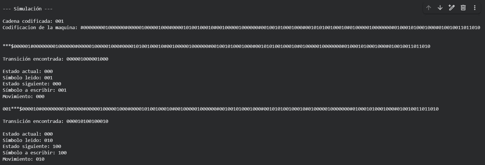
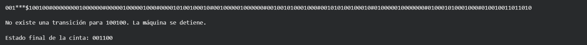

<br>
<div>El contenido final de la cinta es: 001100</div>
<div>Según la codificación utilizada se corresponde con: bn (la palabra original, seguida de una n, que indica que la palabra no es aceptada).</div>

<br>
<br>

*Caso 3 - **"bba"** No acepta la palabra*


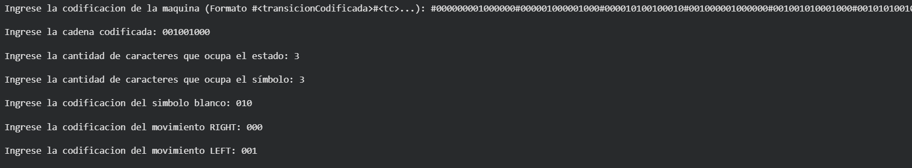
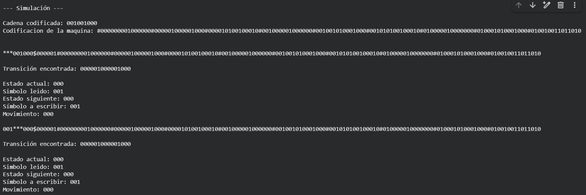
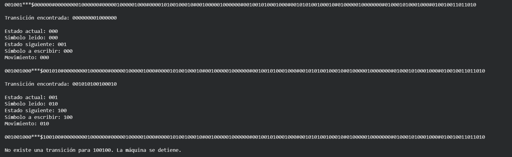

<br>
<div>El contenido final de la cinta es: 001001000100</div>
<div>Según la codificación utilizada se corresponde con: bban (la palabra original, seguida de una n, que indica que la palabra no es aceptada).</div>

<br>


### 4 - Informe final

* Mostrar ejemplos de ejecución

<br>

**A) Ejemplo MT que calcula el nro consecutivo de un binario**

<br>
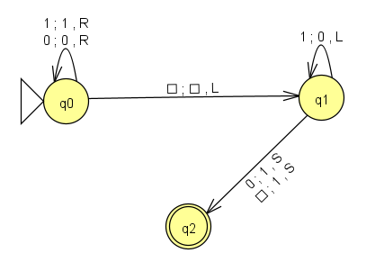

#### Matriz de transiciones

| δ  | 0   | 1   | ▯   | 
|:--:|:---:|:---:|:---:|
| >q0 | q0,0,R | q0,1,R | q1,▯,L | 
| q1 | q2,1,S | q1,0,L | q2,1,S |
| q2  | - | - | - |


<br>

**Codificación de sus estados, símbolos y transiciones en forma numérica**

<br>

*Codificación de los estados:*

| Estado  | Codificación |
|:--:|:---:|
| q0  | 00 |
| q1  | 01 |
| q2  | 10 |

<br>

*Codificación de los símbolos:*

| Símbolo  | Codificación |
|:--:|:---:|
| a  | 00 |
| b  | 01 |
| ▯  | 10 |


<br>

*Codificación de los movimientos:*

| Movimiento  | Codificación |
|:--:|:---:|
| R  | 00 |
| L  | 01 |
| S  | 10 |

<br>

*Matriz de transiciones de M Codificada*

| δ  | 00   | 01   | 10   |
|:--:|:---:|:---:|:---:|
| 00 | 00,00,00 | 00,01,00 | 01,10,01 | 
| 01 | 10,01,10 | 01,00,01 | 10,01,10 | 
| 10  | - | - | - |


<br>

*⟨M⟩*

<div>#0000000000#0001000100#0010011001#0100100110#0101010001#0110100110</div>

<br>

**Ejecución con el número "11" como entrada**

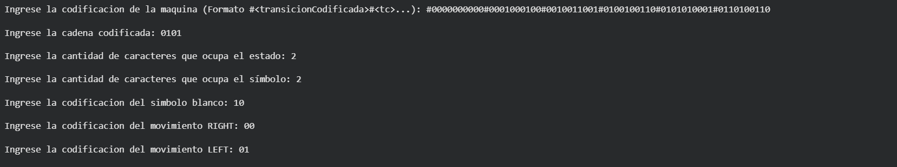
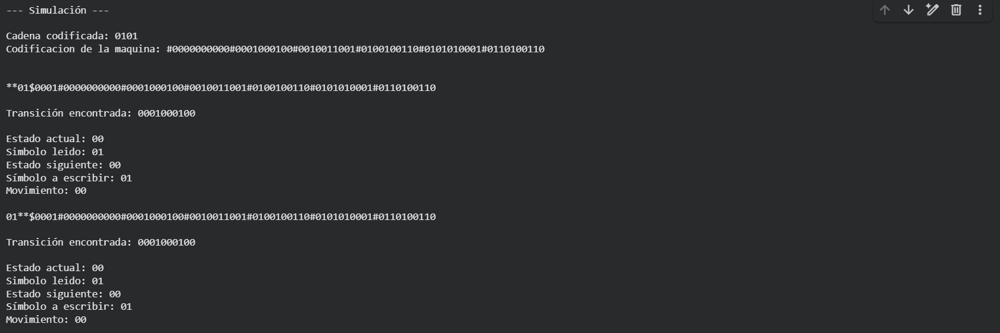
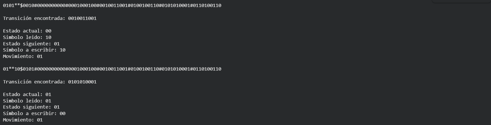
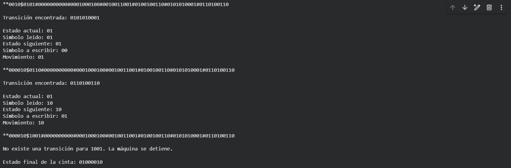

<br>
<div>El contenido final de la cinta es: 01000010</div>
<div>Según la codificación utilizada se corresponde con: 100▯</div>
<br>
<br>

**B) Ejemplo MT que calcula el complemento a 1 de un número binario**

<br>
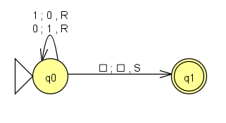

#### Matriz de transiciones

| δ  | 0   | 1   | ▯   | 
|:--:|:---:|:---:|:---:|
| >q0 | q0,1,R | q0,0,R | q1,▯,S | 
| q1  | - | - | - |


<br>

**Codificación de sus estados, símbolos y transiciones en forma numérica**

<br>

*Codificación de los estados:*

| Estado  | Codificación |
|:--:|:---:|
| q0  | 0 |
| q1  | 1 |


<br>

*Codificación de los símbolos:*

| Símbolo  | Codificación |
|:--:|:---:|
| 0  | 00 |
| 1  | 01 |
| ▯  | 10 |


<br>

*Codificación de los movimientos:*

| Movimiento  | Codificación |
|:--:|:---:|
| R  | 00 |
| L  | 01 |
| S  | 10 |

<br>

*Matriz de transiciones de M Codificada*

| δ  | 00   | 01   | 10   |
|:--:|:---:|:---:|:---:|
| 0 | 0,01,00 | 0,00,00 | 1,10,10 | 
| 1 | -| - | - | 

<br>

*⟨M⟩*

<div>#00000100#00100000#01011010</div>

<br>

**Ejecución con el número "11" como entrada**

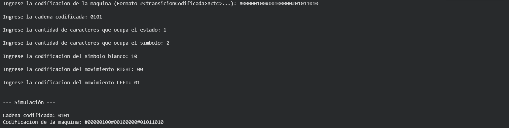
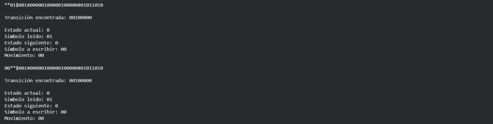
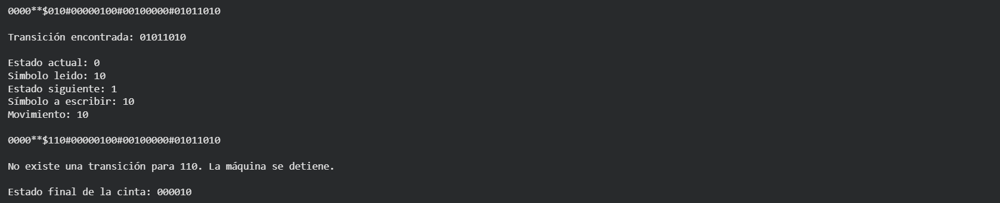

<br>
<div>El contenido final de la cinta es: 000010</div>
<div>Según la codificación utilizada se corresponde con: 00▯</div>
<br>
<br>

* Reflexionar sobre la relación entre la MTU y las computadoras modernas

<br>
<div align="justify">La máquina de Turing universal permite comprender una idea que también está presente en las computadoras modernas: una misma máquina puede realizar tareas diferentes según el programana que se ejecuta. La MTU recibe la codificación de una máquina de Turing y una cadena de entrada, e interpreta las transiciones de esa máquina para simular su funcionamiento.
En este trabajo, el programa en Python cumple ese papel: recibe una máquina codificada y una entrada, y muestra su ejecución paso a paso. Si se cambia la codificación de la máquina de Turing, el simulador puede reproducir otro comportamiento sin modificar el programa. Esto permite ver como las instrucciones pueden representarse como datos para que otra máquina las lea y las ejecute.</div>
