## Extras

### Ejercicio de MTU resuelto como MT Accept

4 - Comprobar si dos palabras formadas con símbolos de Σ = {0, 1, 2} son iguales. Las dos palabras están separadas por el símbolo #

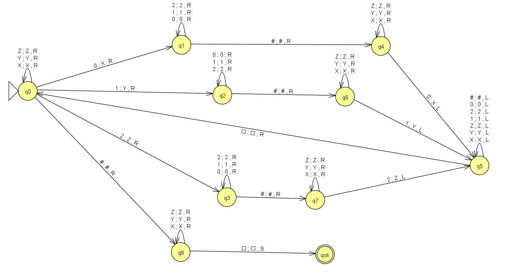
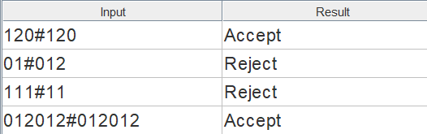

Haz clic aquí para [Descargar el archivo JFLAP](./archivos/MTC4.jff)

 

### Ejemplos MTCalc Apunte

1) MT que calcula el complemento a 1 de un número binario

 
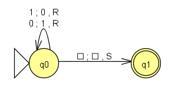

Haz clic aquí para [Descargar el archivo JFLAP](./archivos/MTCEJ1.jff)

 

<b>Ejemplo</b>

 
 

1011001 - Resultado esperado: 0100110

  

Contenido inicial de la cinta

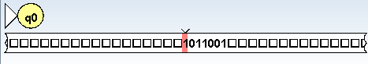

Contenido final de la cinta

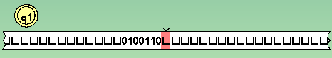

 
 

2) MT que calcula el consecutivo de un número binario

 
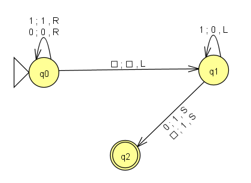

Haz clic aquí para [Descargar el archivo JFLAP](./archivos/MTCEJ2.jff)

 

<b>Ejemplo</b>

 

11 - Resultado esperado: 100

  

Contenido inicial de la cinta

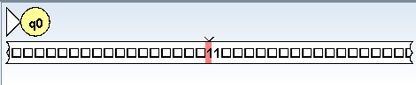

Contenido final de la cinta

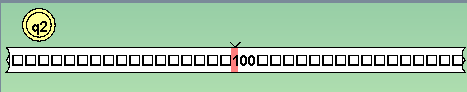

 
 

3) MT que calcula n % 2

 
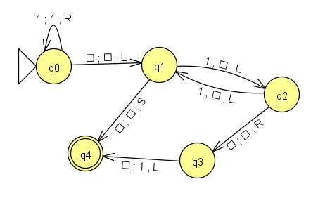

Haz clic aquí para [Descargar el archivo JFLAP](./archivos/MTCEJ3.jff)

 

<b>Ejemplos</b>

 

a) 2 % 2 - Input 11 - Resultado esperado: 0 (blanco)

  

Contenido inicial de la cinta

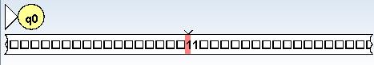

Contenido final de la cinta

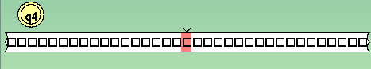

 

b) 5 % 2 - Input 11111 - Resultado esperado: 1

  

Contenido inicial de la cinta

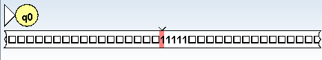

Contenido final de la cinta

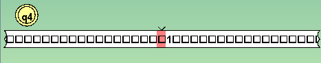

 
 

4) MT que suma 2 números unarios separados por cero

 
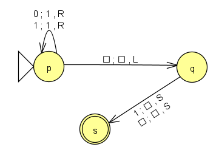

Haz clic aquí para [Descargar el archivo JFLAP](./archivos/MTCEJ4.jff)

 

<b>Ejemplo</b>

 
 

110111 - Resultado esperado: 11111

  

Contenido inicial de la cinta

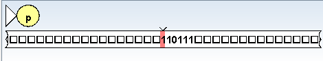

Contenido final de la cinta

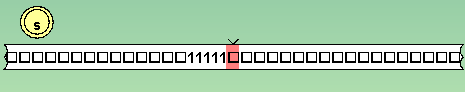

 
 

